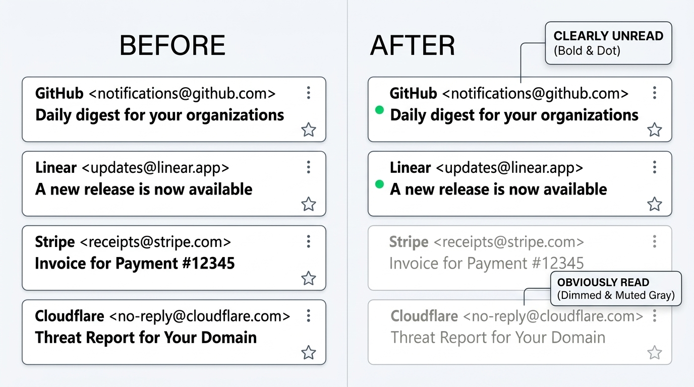

# 🦅 Thunderbird Better Unread

[](LICENSE)
[-orange.svg)](https://www.thunderbird.net/)
[]()

> **A lightweight CSS enhancement that improves visual contrast and hierarchy between read and unread messages in Mozilla Thunderbird Cards View.**  
> 优化 Mozilla Thunderbird（Supernova 及更高版本）卡片视图中已读与未读邮件的视觉对比度与信息层级。

---

[English](#english-overview) | [中文说明](#中文介绍)

---

## 📸 Preview / 视觉对比



| 邮件状态 (State) | 默认样式 (Thunderbird Default) | 增强样式 (With Better Unread) |
| :--- | :--- | :--- |
| **已读邮件 (Read)** | 维持深色与常规字重，在密集列表中视觉权重大 | 采用柔和灰阶与细体，适度降低不透明度 (`opacity: 0.65`)，弱化视觉干扰 |
| **未读邮件 (Unread)** | 与已读邮件的字重和对比度差异较小 | 强化为纯黑/纯白高对比度超粗体 (`font-weight: 800`)，快速聚焦未读信息 |

---

<a name="english-overview"></a>
## 🇬🇧 English Overview

### 💡 Design Context
In **Mozilla Thunderbird 115+ (Supernova)**, the newly introduced **Cards View** uses similar typography colors and font weights for both unread and read messages in the message list. In high-volume inboxes, quickly distinguishing unprocessed emails can require extra scanning effort.

**Thunderbird Better Unread** provides a lightweight, zero-dependency stylesheet patch via `userChrome.css` to restore an intuitive visual hierarchy:
- **Unread Messages**: Rendered with high-contrast text and prominent font weight (`font-weight: 800`).
- **Read Messages**: Softened with neutral gray tones and gentle opacity (`opacity: 0.65`) to reduce visual clutter.
- **Theme Adaptive**: Fully supports both Light Mode and Dark Mode via standard `@media (prefers-color-scheme)`.
- **View Compatibility**: Applies seamlessly to both Cards View (`li`) and classic Table View (`tr`).

---

### 🚀 Quick Start (Automated Installation)

#### Windows
1. Download or clone this repository.
2. Run **`scripts/install.bat`**.
3. Restart Thunderbird.

#### macOS / Linux
1. Clone this repository:
   ```bash
   git clone https://github.com/santiago0071/thunderbird-better-unread.git
   cd thunderbird-better-unread
   ```
2. Execute the install script:
   ```bash
   chmod +x scripts/install.sh
   ./scripts/install.sh
   ```
3. Restart Thunderbird.

---

### 🛠️ Manual Installation

If you prefer configuring files manually:

1. In Thunderbird, navigate to **Settings** (`≡` menu -> **Settings**) -> **General**.
2. Scroll to the bottom and click **Config Editor...** (about:config).
3. Search for preference:
   ```text
   toolkit.legacyUserProfileCustomizations.stylesheets
   ```
   Set it to **`true`**.
4. Go to **Help** -> **Troubleshooting Information**.
5. Under **Application Basics**, locate **Profile Folder** (or Profile Directory) and click **Open Folder** / **Show in Finder**.
6. Inside the profile directory, create a folder named `chrome` (in lowercase) if it does not already exist.
7. Copy [`chrome/userChrome.css`](chrome/userChrome.css) into the `chrome` directory.
8. Restart Thunderbird.

---

<a name="中文介绍"></a>
## 🇨🇳 中文介绍

### 💡 设计背景
在 **Mozilla Thunderbird 115（Supernova 架构）**及后续版本中，卡片视图（Cards View）对已读邮件与未读邮件采用了接近的字体颜色和字重定义。当收件箱邮件较多时，用户需要花费额外精力来定位未处理的邮件。

本项目通过轻量、无外部依赖的 `userChrome.css` 样式规则，建立更符合直觉的视觉层级：
- **未读邮件**：加粗高对比度显示（800 字重），确保第一眼即可准确定位；
- **已读邮件**：采用柔和中灰色阶并降低透明度（0.65 不透明度），有效弱化背景干扰；
- **深浅色自适应**：通过 `@media (prefers-color-scheme)` 原生支持浅色与深色（Dark Mode）模式；
- **多视图兼容**：同时适配卡片视图（Cards View）与经典表格视图（Table View）。

---

### 🚀 一键快速安装

#### Windows 环境
1. 下载或克隆本项目。
2. 双击运行 **`scripts/install.bat`**。
3. 重启 Thunderbird 即可生效。  
   *(脚本会自动检测 Profile 路径、拷贝样式文件并配置 `user.js` 开启样式扩展)*

#### macOS / Linux 环境
1. 克隆代码仓库：
   ```bash
   git clone https://github.com/santiago0071/thunderbird-better-unread.git
   cd thunderbird-better-unread
   ```
2. 运行安装脚本：
   ```bash
   chmod +x scripts/install.sh
   ./scripts/install.sh
   ```
3. 重启 Thunderbird 即可完成部署。

---

### 🛠️ 手动配置步骤

如需手动安装与核验：

1. 打开 Thunderbird，进入右上角菜单 `≡` -> **设置 (Settings)** -> **常规 (General)**；
2. 滑动至页面最底部，点击 **配置编辑器... (Config Editor...)**；
3. 检索配置项：
   ```text
   toolkit.legacyUserProfileCustomizations.stylesheets
   ```
   双击确保其为 **`true`**；
4. 点击顶部菜单 **帮助 (Help)** -> **故障排除信息 (Troubleshooting Information)**；
5. 在“应用程序基本信息”列表中找到 **配置文件夹 (Profile Folder)**，点击其对应的 **打开文件夹**；
6. 在该目录下新建名为 `chrome` 的文件夹（全部小写）；
7. 将本项目中的 [`chrome/userChrome.css`](chrome/userChrome.css) 复制到 `chrome` 文件夹内；
8. 重启 Thunderbird。

---

### ❓ 常见问题排查 (FAQ)

<details>
<summary><b>1. 重启后样式未生效？</b></summary>

- **核对首选项**：请确认 `toolkit.legacyUserProfileCustomizations.stylesheets` 是否已正确切换为 `true`。
- **核对路径结构**：样式文件必须位于当前活动 Profile 目录下的 `chrome/userChrome.css`。
- **文件后缀名检查**：Windows 默认隐藏扩展名环境下，新建文件可能被误存为 `userChrome.css.txt`，请确认后缀名严格为 `.css`。
</details>

<details>
<summary><b>2. 如何恢复默认外观？</b></summary>

进入对应的 Profile 文件夹，删除 `chrome/userChrome.css` 文件（或整个 `chrome` 文件夹），重启 Thunderbird 即可恢复官方默认样式。
</details>

---

## 📄 License

本项目遵循 [MIT License](LICENSE) 开源许可协议。
欢迎提交 Issue 与 Pull Request。
